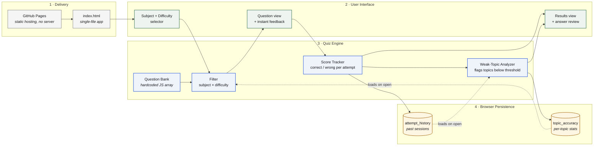

# JEE Quiz Studio

A single-page, no-dependency quiz app for practicing JEE-level Physics, Chemistry, and Mathematics questions — with per-topic accuracy tracking to surface weak areas over time.

https://happ3ns.github.io/JEE-Quiz-Generator/

## Architecture



## Features

- Pick a subject (Physics / Chemistry / Mathematics / Mixed), difficulty, and question count
- Instant feedback per question, with a worked explanation
- Score, per-topic accuracy breakdown, and full answer review after each attempt
- Weak-topic tracking across attempts, stored locally in your browser (`localStorage`) — no account, no backend
- Fully responsive, keyboard-accessible, works offline once loaded

## Why I built this

Built to make my own JEE revision more targeted — instead of solving questions at random, the topic-accuracy tracker tells me exactly which topics to revise next.

## Running it

No build step, no dependencies. Just open `index.html` in a browser, or serve it locally:

```bash
python3 -m http.server 8000
# then visit http://localhost:8000
```

## Deploying for free with GitHub Pages

1. Push this repo to GitHub.
2. Go to **Settings → Pages** in your repo.
3. Under "Build and deployment", set source to **Deploy from a branch**, branch `main`, folder `/ (root)`.
4. Your app will be live at `https://<your-username>.github.io/<repo-name>/`.

## Project structure

```
├── index.html   # entire app — markup, styles, and logic
└── README.md
```

Everything lives in one file by design, so it's easy to read end-to-end and easy to deploy anywhere that serves static files.

## Extending the question bank

Questions live in the `BANK` array near the top of the `<script>` block in `index.html`. Each entry looks like:

```js
{
  subject: "Physics",
  topic: "Mechanics",
  difficulty: "medium",
  q: "Question text",
  options: ["A", "B", "C", "D"],
  answer: 1,          // index of the correct option
  explain: "Why that answer is correct."
}
```

To add questions: append more objects to `BANK`. To add a new subject or topic, just use a new string — the setup screen and topic-accuracy table pick it up automatically.

## Ideas for extending this further

- [ ] Move the question bank into a separate `questions.json` file and fetch it, so it's easier to maintain as it grows
- [ ] Add negative marking, matching the actual JEE marking scheme
- [ ] Export attempt history as CSV

## License

MIT — use, modify, and extend freely.
